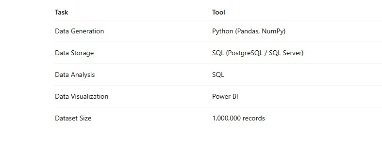
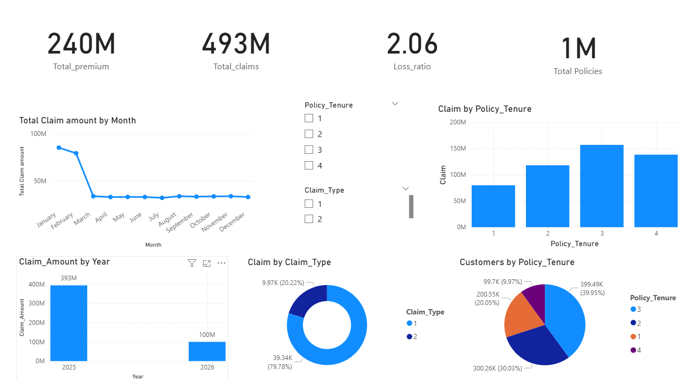

# 🚗 Insurance Portfolio Risk & Profitability Analysis

A **Business Intelligence project** that simulates an **insurance company dataset**, analyzes **policy sales and claim behavior**, and builds an **interactive Power BI dashboard** to measure profitability and risk.

This project demonstrates **end-to-end data analytics workflow** including:

-   Data simulation using Python
    
-   Database modeling with SQL
    
-   Business analysis using analytical queries
    
-   Interactive dashboard creation using Power BI

# 🧠 Business Problem

Insurance companies must monitor **risk vs profitability**.

If claims exceed premium revenue, the company suffers losses.

This project simulates an **auto insurance portfolio** and answers key business questions:

-   How much premium revenue is generated?
    
-   What is the total claim cost?
    
-   Which policy tenure is the most risky?
    
-   What is the loss ratio across policies?
    
-   How do claims vary across months and years?
<br>
# 🛠 Tech Stack


# ⚙️ Data Generation Logic (Python)

The dataset was simulated using **Pandas** and **NumPy** with specific probability rules:

-   **Tenure Distribution:** 1yr (20%), 2yrs (30%), 3yrs (40%), 4yrs (10%).
    
-   **2025 Claims:** Triggered for vehicles purchased on the 7th, 14th, 21st, or 28th (30% probability).
    
-   **2026 Claims:** Only for 4-year policies (10% probability) between Jan 1 – Feb 28.
  

<br>
# 🗄 SQL Data Model

### Policy Table

SQL

```
CREATE TABLE policy_sales (
    customer_id INT,
    vehicle_id INT,
    vehicle_value INT,
    premium INT,
    policy_purchase_date DATE,
    policy_start_date DATE,
    policy_end_date DATE,
    policy_tenure INT
);

```

### Claims Table

SQL

```
CREATE TABLE claims (
    claim_id INT,
    customer_id INT,
    vehicle_id INT,
    claim_amount INT,
    claim_date DATE,
    claim_type INT
);

```

----------


# 📊 Analytical Queries

> **Q 1. Calculate the total premium collected during the year 2024.**

SQL

```
SELECT SUM(premium) AS total_premium
FROM policy_sales;

```

----------

> **Q 2.  Calculate the total claim cost for each year (2025 and 2026) with a monthly breakdown.**

SQL

```
SELECT 
YEAR(claim_date) AS year,
MONTH(claim_date) AS month,
SUM(claim_amount) AS total_claim_cost
FROM claims
GROUP BY YEAR(claim_date), MONTH(claim_date)
ORDER BY year, month;

```

----------

> **Q 3. Calculate the claim cost to premium ratio for each policy tenure (1, 2, 3, and 4 years).**

SQL

```
SELECT
p.policy_tenure,
SUM(c.claim_amount) / SUM(p.premium) AS claim_ratio
FROM policy_sales p
LEFT JOIN claims c
ON p.vehicle_id = c.vehicle_id
GROUP BY p.policy_tenure;

```

----------

> **Q 4. Calculate the claim cost to premium ratio by the month in which the policy was sold  (January
December 2024).**

SQL

```
SELECT
MONTH(policy_purchase_date) AS sale_month,
SUM(c.claim_amount) / SUM(p.premium) AS ratio
FROM policy_sales p
LEFT JOIN claims c
ON p.vehicle_id = c.vehicle_id
GROUP BY MONTH(policy_purchase_date);

```

----------

> **Q 5. If every vehicle that has not yet made a claim eventually files exactly one claim during the
remaining policy tenure, estimate the total potential claim liability.**

SQL

```
WITH total_vehicles AS (
    SELECT COUNT(*) AS total FROM policy_sales
),
claimed AS (
    SELECT COUNT(DISTINCT vehicle_id) AS claimed FROM claims
)
SELECT 
    CAST((total - claimed) AS BIGINT) * 10000 AS future_claim_liability
FROM total_vehicles, claimed;

```

----------

> **Q 6  Calculate the premium already earned by the company up to February 28, 2026.**

SQL

```
SELECT
SUM(
    (premium * 1.0 / DATEDIFF(day, policy_start_date, policy_end_date)) 
    * 
    DATEDIFF(day, policy_start_date, 
        CASE 
            WHEN policy_end_date < '2026-02-28' THEN policy_end_date 
            ELSE '2026-02-28' 
        END
    )
) AS earned_premium
FROM policy_sales
WHERE policy_start_date <= '2026-02-28';

```

----------

<br<br>
# 📊 Project Dashboard




# 📈 Findings 
<br>
- Claim costs peak in January–February, then stabilize across the year. 2025 accounts for the majority of claim payouts (~₹393M). 
- 3-year policies generate the highest claim exposure due to the largest customer base. 
- 80% of claims are first-time claims, with only a small portion being repeat claims. 
- Policy distribution is heavily concentrated in 3-year tenures (~40%).
- The loss ratio of 2.06 indicates claims exceed premium revenue, suggesting potential pricing adjustments may be required.


# 🚀 Skills Demonstrated

-   ✔ Data Simulation & Large Dataset Handling
    
-   ✔ SQL Analytical Queries & Database Design
    
-   ✔ Business KPI Design & Risk Analysis
    
-   ✔ Advanced Data Visualization (Power BI)
